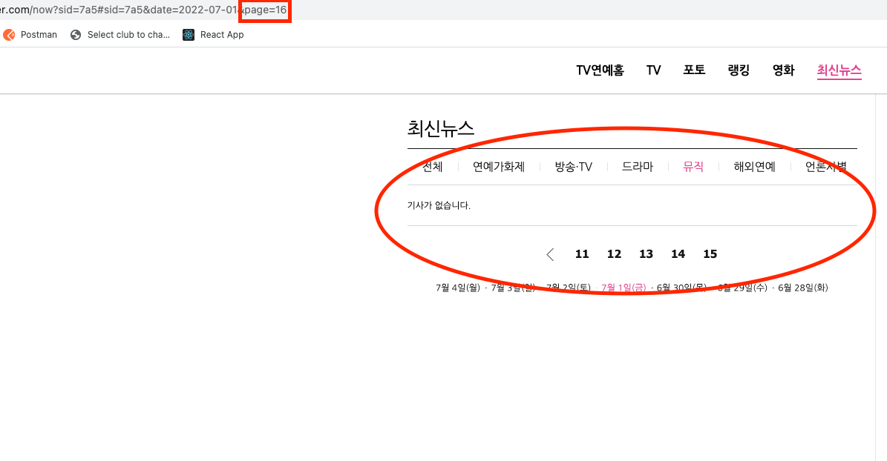

# 미션3 - 크롤링

**네이버 TV연예/최신뉴스/뮤직의 7월1일 전체 페이지의 뉴스를 크롤링 해보기 **

[셀레니움 사용시 구글 드라이버 다운로드 링크](https://chromedriver.chromium.org/downloads)

> ### 전략
> url의 인자값으로 page를 지정한다. page를 하나씩 증가 시키다 빈 페이지가 되면 종료한다.



<br>

## 코드

### news_croller : 하나의 뉴스 기사 페이지에 있는 정보를 크롤링 해온다.

``` python
def news_croller(url): # 뉴스 기사 페이지 크롤링
    request = requests.get(url)
    soup = BeautifulSoup(request.text, 'html.parser')

    # news_writing_time
    try:
        news_writing_time = soup.select_one('#content > div.end_ct > div > div.article_info > span:nth-child(1) > em').get_text()
    except:
        news_writing_time = ''
    # news_img
    try:
        news_img = soup.select_one('#img1')['src']
    except:
        news_img = ''
    # news_body
    try:
        news_body = soup.select_one('#articeBody').get_text().strip()
    except:
        news_body = ''
    # news_author
    try:
        news_author = soup.select_one('#content > div.end_ct > div > div.article_journalist > div > div > div > div > div > div.journalistcard_summary > div > div > div.journalistcard_summary_info > a > div.journalistcard_summary_name').get_text()
    except:
        news_author = ''

    return news_writing_time, news_img, news_body, news_author
```

<br>

### news_page_croller : 뉴스 목록 페이지를 크롤링 해온다.
- date : 문자열 형으로 'yyyy-mm-dd' 넣어준다
- page : int형으로 넣어준다. -> 이번 과제에서 15페이지 까지 기사가 있었는데 16을 넣게되면 news_list가 빈 배열이 된다.
- *if len(news_list) == 0:* : 사실 이 부분은 필요없는 조건이긴 하다. (어차피 news_list가 빈문자열이라 for문을 돌지 않고 바로 []가 리턴됨) 하지만 명시적으로 종료조건을 보여줄수 있기에 남겨두었다.
``` python
def news_page_croller(date, page): # 뉴스 목록 페이지 크롤링
    global index # index를 global 변수로 선언

    browser.get(base_url + '/now?sid=7a5#sid=7a5' + '&date=' + date + '&page=' + str(page))
    html = browser.page_source
    soup = BeautifulSoup(html, 'html')

    news_list = soup.find_all('a', class_ = 'tit')

    if len(news_list) == 0: # 목록 페이지에서 받아온 페이지가 없으면 빈 리스트 리턴
        return []

    l = []
    for news in news_list:
        news_title = news.get_text()
        news_url = base_url + news['href']
        news_writing_time, news_img, news_body, news_author = news_croller(base_url + news['href'])
        l.append([index, news_title, news_url, news_writing_time, news_img, news_body, news_author])
        index+=1
        print(news_title, end='\n\n')

    return l
```

<br>

### 전체코드

``` python

import requests
from bs4 import BeautifulSoup
import pandas as pd
from selenium import webdriver

base_url = 'https://entertain.naver.com'
browser = webdriver.Chrome('./chromedriver')

def news_croller(url): # 뉴스 기사 페이지 크롤링
    request = requests.get(url)
    soup = BeautifulSoup(request.text, 'html.parser')

    # news_writing_time
    try:
        news_writing_time = soup.select_one('#content > div.end_ct > div > div.article_info > span:nth-child(1) > em').get_text()
    except:
        news_writing_time = ''
    # news_img
    try:
        news_img = soup.select_one('#img1')['src']
    except:
        news_img = ''
    # news_body
    try:
        news_body = soup.select_one('#articeBody').get_text().strip()
    except:
        news_body = ''
    # news_author
    try:
        news_author = soup.select_one('#content > div.end_ct > div > div.article_journalist > div > div > div > div > div > div.journalistcard_summary > div > div > div.journalistcard_summary_info > a > div.journalistcard_summary_name').get_text()
    except:
        news_author = ''

    return news_writing_time, news_img, news_body, news_author

def news_page_croller(date, page): # 뉴스 목록 페이지 크롤링
    global index # index를 global 변수로 선언

    browser.get(base_url + '/now?sid=7a5#sid=7a5' + '&date=' + date + '&page=' + str(page))
    html = browser.page_source
    soup = BeautifulSoup(html, 'html')

    news_list = soup.find_all('a', class_ = 'tit')

    if len(news_list) == 0: # 목록 페이지에서 받아온 페이지가 없으면 빈 리스트 리턴
        return []

    l = []
    for news in news_list:
        news_title = news.get_text()
        news_url = base_url + news['href']
        news_writing_time, news_img, news_body, news_author = news_croller(base_url + news['href'])
        l.append([index, news_title, news_url, news_writing_time, news_img, news_body, news_author])
        index+=1
        print(news_title, end='\n\n')

    return l


index = 0
news_list = [] # 모든 뉴스를 담을 리스트
page = 1
while True:
    temp = news_page_croller('2022-07-01', page)
    if not temp: # temp가 빈 리스트 일때 종료
        break
    news_list += temp
    page += 1

df = pd.DataFrame(news_list, columns=['index', 'news_title', 'news_url', 'news_writing_time', 'news_img', 'news_body', 'news_author'])
df.to_excel('naver_news.xlsx', index=False)
```

<br>

## 결과물
[naver_news.xlsx](https://github.com/HaiSeong/data_analysis_study/raw/main/mission3/naver_news.xlsx)
